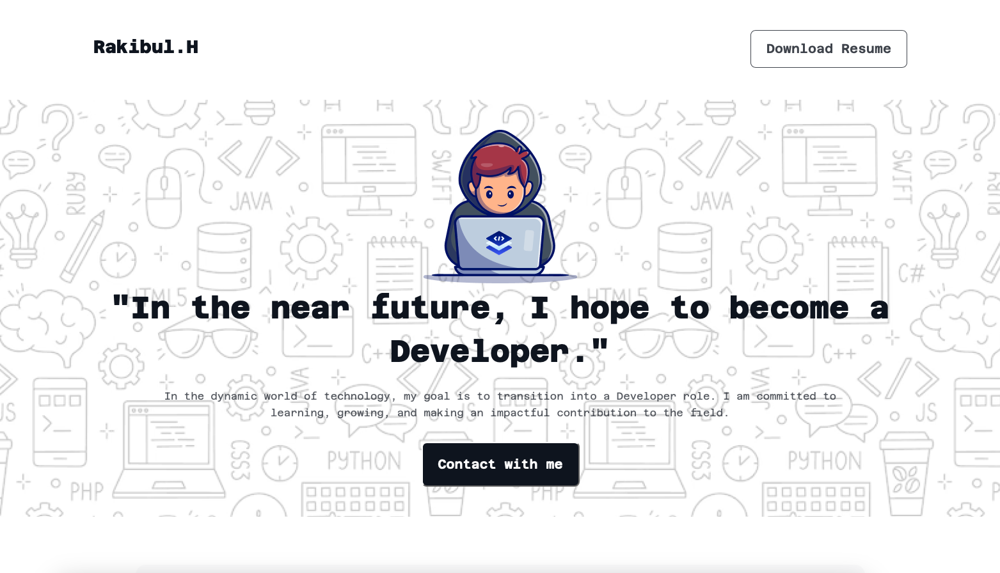

# Rakibul.H - Web Developer Portfolio

## Project Overview
This is a personal portfolio website for Rakibul Hasan, a web developer passionate about coding and creating innovative web solutions. The project showcases my skills, inspirations, current learning goals, and future aspirations.

## Live Project
https://rakibcodes36.github.io/assignment-01/

## Screenshot

 

## Technologies Used
- HTML5
- CSS3


## Features
- **Personal Introduction:** A detailed overview of Rakibul Hasan's journey into web development.
- **Web Development Section:** Explanation of why web development is important and future goals.
- **Inspiration & Learning Goals:** Showcases learning targets and next steps in development.
- **Video Integration:** Embedded YouTube video for inspiration.
- **Support Section:** Users can provide feedback or suggestions.
- **Downloadable Resume:** Visitors can download the developer's resume.
- **Social Media Links:** Links to GitHub, LinkedIn, and Facebook profiles.

## Dependencies
- Google Fonts (Azeret Mono)
- External assets (images, videos)

## Installation & Running the Project Locally
1. Clone the repository:
   ```sh
   git clone https://github.com/your-username/your-repository.git
   ```
2. Navigate to the project folder:
   ```sh
   cd your-repository
   ```
3. Open `index.html` in your browser:
   ```sh
   open index.html
   ```
   or
   ```sh
   start index.html  # Windows
   ```

## Live Demo & Resources
- **Live Website:** https://github.com/rakibCodes36/assignment-01
- **GitHub Repository:** https://rakibcodes36.github.io/assignment-01/


